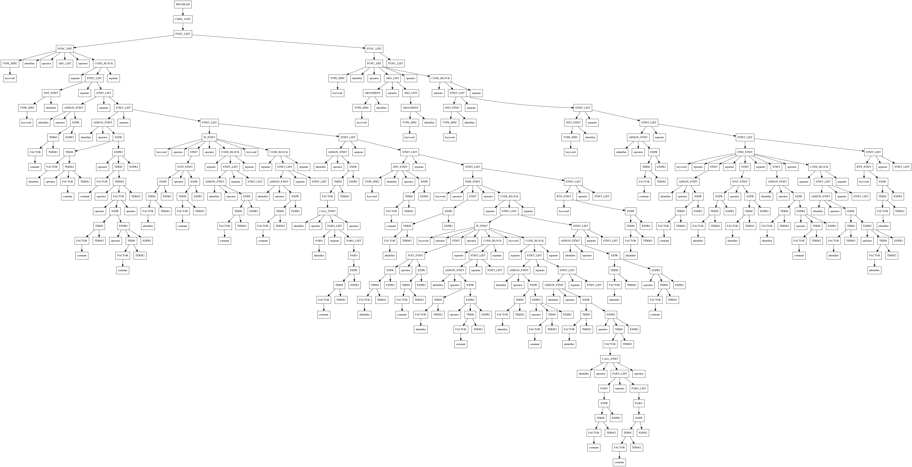

## 代码生成实验报告

---

### 1. 实验目的

实验选择 C 语言的一个子集，基于 BIT-MiniCC 构建 C 语言语法子集的代码生成模块，该语法分析器可以读入 XML 文件形式的语法分析树，并根据寄存器分配，生成对应的 X86 汇编代码。

其中生成可以执行的汇编代码是基本要求和核心任务，通过实际的生成对应的 X86 的汇编代码，体会程序编译过程中的发生的一系列过程，对编译优化和编译的实质有更深的本质上的了解。对常用的编译工具(GCC, Clang)等内部实现的原理和实践相结合，感受整个编译的流程。

因为理论上编译程序的最后一个经典的阶段就是代码生成，这一步可以讲源程序的中间代码表示输出成为等价的目标代码，完成这种功能的程序模块称之为是代码生成器，本次实验的核心内容就是完成一个针对特定 C 语言文法的代码生成器，具体的 C 语言的文法子集详见附录。

如下图所示，代码生成器位于整个编译过程的最后，牵扯到指令选择，指令调度和寄存器管理等等几个方面，具体的实验内容在之后讲解


### 2. 实验内容

1. 左偏和右偏树的平衡化

   通过语法分析得到的了一棵完整的语法树，但是该语法树中存在有大量的不平衡结构和冗余信息，通过对语法树进行变化，得到抽象语法树，变换的主要过程就是将左递归导致的左斜树转换为平衡结构，具体的细节在之后分析。

2. 中间代码生成

   中间代码是一种面向语法，容易翻译成对应的目标程序的源程序的等效内部表示的代码，其可理解性和易于生成目标代码的成都结余源语言和目标语言之间，可以作为代码生成的一个过渡阶段。

   为了方便对程序进行分析和编写，采用经典的递归下降分析法针对语法分析中自定义的文法构建递归下降分析器，利用 **后序遍历语法树** 的算法分析得到中间代码。并且在本实验中，采用 **四元式** 作为中间代码。

3. 扩展四元式

   通过对中间代码生成得到的四元式进行扩展，扩展成为标准的 X86 汇编代码，并且在 DOSBox 中利用 MASM.EXE, LINK.EXE 对生成的汇编代码进行解释运行，查看编译的效果，并逐步的分析修正和添加功能

### 3. 实验平台和使用注意事项

1. 实验平台: Ubuntu 18.04

2. 实验环境: DOSBox 0.74

3. 实验工具: MASM.EXE, LINK.EXE

4. 代码编写: Python3.6 (PEP498 f-strings 请使用 Python3.6 来执行代码)

5. 外部依赖库: Pydot (该第三方库仅仅是为了可视化语法树结构，并没有任何辅助实现代码生成器的成分)

6. 依赖文件: 

   * `test.c`: 输入 C 语言文件
   * `test.parser.xml`: 输入，语法分析树结构
   * `test.balance.xml`: 输出，平衡语法分析树结构
   * `test.balance.png`: 输出，Pydot 生成的可视化平衡语法分析树图片
   * `test.asm`: 输出，生成的汇编 X86 代码文件

7. 最终的  C 语言特定文法，测试 C 语言代码，中间代码，X86 汇编代码结果详见附录

8. 关于框架

   我并没有有效的调通框架运行这部分的代码，所以我想检查的学长可以运行我对应的 run.sh 文件，这个文件替换了框架关于实现这部分实验的所有功能，但是框架我确实没有成功的运行起来，我也没有有效的调试手段检查老师的包，所以希望检查的学长运行我的 run.sh 脚本，非常感谢。

### 4. 实验过程

1. 语法树平衡

   >以下的图示分析全部基于 Pydot, 如果需要检查这一部分请使用带有 pydot 的解释器运行代码中的特定的函数

   代码编写和测试完之后，回头看看语法树平衡的作用。在实验之前仅仅觉得语法树平衡其实是一个可有可无的组成部分，但是通过整体的分析后发现，语法树的平衡在试验中起到了大大简化中间代码生成的作用，通过对语法树进行平衡，删除没有必要的中间节点，有效的降低了递归下降分析的复杂度，方便了工程实现。

   平衡树算法有效的将语法树中的大量的无用的中间的非终结节点进行合并和回复，构造了一个利于递归下降分析的平衡的语法树，方便之后的中间代码生成的 **后序遍历** 的思路的实践和展开。

   * 平衡树算法

     对于类似于如下的文法的产生式

     ```c
     A -> B, A | a
     B -> b
     ```

     我们可以发现，如果在源代码中，存在有大量的 b 元素的话，将会产生大量的左递归形式构建的偏树，通过平衡树算法有效的将递归的单结构树转化成多叉树从而实现对树在深度上的缩减，简化 **后序遍历** 的程序的复杂地，就如下图所示

     ```xml
     <A>
       <B>
         <b>b</b>
       </B>
       <A>
         <B>
           <b>b</b>
         </B>
         <A>
           <B>
             <b>b</b>
           </B>
           <A>
             <B>
               <b>b</b>
             </B>
             <A>
               <a>a</a>
             </A>
           </A>
         </A>
       </A>
     </A>
     ```

     上述的简易的语法生成树的实例代码构建的语法树和平衡语法树如下(如果需要运行这样的实例，请使用 pydot 在 Python3.6 的解释器上运行对应的 showtree 函数) 

     可以发现，通过对语法树 进行平衡之后，成功的减少了语法树中的节点的个数并且有效的降低了语法树的深度，这对于后序遍历和递归下降来说是非常有好处的。

     ​

     核心算法

     * 基本思路

       利用 **BFS 广度优先搜索**，从根节点 `root`开始按层遍历语法树，如果子节点中存在和当前的父节点相同属性的节点的话，将子节点的所有孩子归并到当前的父节点上，压缩层数，在归并扫描的过程中，采用 **后序遍历**。

     * 算法流程图

       


   * 平衡语法树之前

     

   * 平衡语法树之后

     

   * 平衡树算法核相关代码

     1. 平衡树代码

        

     2. 使用 Pydot 可视化展示语法树函数

        

2. 中间代码生成

   中间代码生成是一种面向语法，易于翻译成目标程序的源程序的等效内部表示代码，我认为这是在整个编译过程中非常重要的异步，通过将具体的语法树通过中间代码的解释翻译成可以有效扩展成为目标代码的中间代码，能有效的扩展表示源程序的语言结构。这种目标代码形式和具体的目标机器没有具体的关系，所以编译的程序可以有效的移植到其他的机器上，并且中间代码也有利于进行代码优化(当然，这并不是我们在本次实验中需要考虑的问题)

   常用的中间代码的形式有很多种，各有优缺点

   * 逆波兰表达式

     逆波兰表达式相对于传统的中缀表达式而言，在运算的时候不存在扩韩，但是仍然可以有效的表明运算符号的运算顺序，在运算的处理非常方便。

     逆波兰表达式在表达式的运算中优点非常明确，在文法中的表达式部分中，为了将表达式的运算展示的非常清晰明了，我在将表达式转换成最终的中间代码 **四元式** 之前对所有表达式内容转换成对应的逆波兰表达式，然后将逆波兰表达式的所有的对应的运算全部转换成 **四元式** ，实践证明，这种转换方式非常有利与代码的编写和调试。

   * 4-元式

     4-元式是编译程序中的中间语言中非常常见的一种表示类型，它具有和汇编代码非常相似的结构，也决定了它非常容易转换成汇编语言的优点，4-元式的每一个中间代码指令存在有 4 个域，一般的形式如下图所示。

     

     其中 OP 是操作符号， ARG1, ARG2 作为第一操作数和第二操作数， RESULT 为计算结果操作数，通常是一个内存地址或者是寄存器，通常是一个临时变量，用 Ti 表示。使用四元式表示中间代码对代码优化很方便，在生成目标代码时可以使用引入的临时变量，将使得生成的目标代码比较简单。

   * 核心代码解析

     核心代码采用的是，递归下降的思路设计的，针对文法的不同的非终结符构建对应的返回函数，从根节点开始不断的从下层抽取对应的表达式，按照 **后序遍历** 的顺序将下层子节点抽取的对应的中间代码拼合在一起构成中间代码序列。

     每个函数返回两种具体的信息

     1. 控制信息: 控制信息中包含了数据信息的标识类型或者是数据信息的最终返回结果
     2. 数据信息: 数据信息是一个包含该文法非终结符号所有对应的4-元式中间代码列表，按照递归下降的调用顺序逆向的将结果返还到最终的根节点上。

     如下是对应的 **递归下降部分函数** 的展示

     

   * 符号表

     符号表是记录整个源程序中重要信息的一种有效的工具，在最后的汇编代码生成部分中，具有非常重要的意义，通过对符号表中的数据记录在 **数据段**, **代码段** 中可以有效的将程序的运行环境完整的刻画出来。通过将必要的数据整理成全局变量，可以有效的实现符号表的定义工作。

     符号表的信息用于决定程序中的名字所代表的数据对象的运行地址

     

   * 条件语句的中间代码展开

     

   * 循环语句的中间代码展开

     while:

     

     for:

     

3. 汇编代码生成

   1. 描述

      在上一步获得了中间代码之后，目前就可以有效的构建代码生成器了。代码生成器的输入主要是中间代码，符号表等相关的信息，代码生成器的最终输出是目标程序。

   2. 代码生成的构建算法

      为了有效的处理对应的参数传递和运算结果传递和寄存器的有效分配，在符号表中引入了 **内存区**，**参数区**，**临时区**，寄存去和程序的执行状态转换过程如下图所示。

      函数调用解析的汇编扩展采用了一种技巧，所有的参数都必须存在与参数取 parazone 中，其中 parazone0 表示参数区中的参数的个数， parazone1, parazone2, ... 表示不同的参数(可能是传入参数也可以是传出参数，具体个数由 parazone0 参数区第一个内存单元控制)

      

   3. 代码生成(4-元式)展开核心代码分析

      * 如下是代码生成的核心代码，首先通过符号表导入 memoryzone, parazone, pausezone 内存区，参数区，临时区数据单元，虚拟化 4 个主要的寄存器

      * 然后初始化数据段

      * 解析代码段

        在解析代码段的过程中，利用中间代码的不同标识区分不同的控制动作，产生不同的对应的汇编代码。

      

### 5. 实验结果和分析

>为了展示编译的效果，这里采用了不同于我调整代码时用到的复杂的 C 语言代码，为了展示最终代码的可运行性，我决定采用简易的 C 语言测试代码，更加复杂的测试代码请详见附录。

1. 测试 C 语言代码

   

2. 语法树

   

3. 抽象语法树(平衡树)

   

4. 中间代码 - 4-元式

   

5. 汇编代码

   

6. 添加输出单元并在 DOSBox 中运行

   * 输出单元添加

     

   * 运行结果

     正如上图所示，正确的结果是 9,编译过程完全正确，代码生成器完全正确，一个完整的编译器完成。

     

### 6. 实验心得

通过这次实验，我的感触非常多，在这里想要着重的记录一下

1. 首先面对这样一个任务的时候，是束手无措的，没有一个有效的指导方法和算法供我去实现一个完整的代码生成器，所以一开始是比较慌张的，想了很多的方法，尝试了很多的思路，最终经过提炼终于得到了一个有效的方式。这个算法就是递归下降分析，在之前的语法分析的时候，学习过了递归下降分析，但是我采用的是标准的 LR(1) 分析算法实现的词法分析，当时对递归下降这种算法并没有考虑，主要一部分原因在于我认为递归下降这个算法不够"优美"，所以我也没有对这个算法投入了太多的关注。

   但是当我遇到代码生成这个复杂的任务的时候，我在经历了很多的尝试之后决定使用采用了递归下降的分析方法，主要是考虑到了以下几点。

   * 递归下降分析是和文法紧密结合的，通过对文法中的非终结符构建 **返回模式函数(我这么称呼它)** 可以有效的将整个递归解析语法树的流程完整的呈现出来
   * 代码编写的复杂度得以有效的降低
   * 方便调试和运行检测

   当然，这种方法也存在一些缺点，扩展性不强和冗余代码多的缺点也是非常的鲜明，但是从完成这个任务的出发点来看，我决定采用这种算法构建针对特定文法的代码生成器是非常有效的。

2. 关于 BFS 和后序遍历

   经过一些尝试和思考之后，我在平衡语法树中采用了标准的 BFS 算法和后序遍历的方式，有效的将语法树进行了平衡操作，但是在完成了平衡树和可视化展示后，我突然发现，这种 BFS 和后序遍历的方式其实本质上和逆波兰表达式非常的类似，所以我认为，理论上直接将程序转换成为逆波兰表达式的结构可以有效的将一个程序表示成汇编的目标代码的。但是这样的尝试我们并没有去实践，仅供参考和之后的同学们去尝试。

3. 关于代码区，临时区，参数区的灵感

   关于代码区，临时区，参数区的使用的我查看教材中的对应的寄存器分配中的内容的时候，我突然想到在转换成汇编代码的时候，如果寄存器的内容和状态没有有效的记录和交换的话，程序是失败的，但是寄存器分配又是一个及其困难去优化和实践的问题，**所以我决定将工作的重点放在内存区上，而不是寄存器上**。

   代码区存放主要的内存变量内容，临时区存放表达式计算中的临时值，参数去存放函数调用的参数传递过程中的参数。通过设计上述设计的状态图，就可以有效的将整个计算的重点转移到内存区上。从而实现对应的有效的代码生成器。

### 7. 附录

1. 特定 C 语言文法

   1. 限定

      - 不支持数组
      - 不支持作用域
      - 支持 if-then-else 条件语句
      - 支持 while, for 循环语句
      - 支持双目运算 +, -, *, /, %
      - 支持函数调用和参数控制

   2. 文法

      ```c
      // this is the rule of the C language, which is just the subcase of It, and I want to use these rules to create the parser for using, or this is the test file 
      // create by GMFTBY
      // Time 2018.4.28
      // Do not allow the `|` in the rule
      // The first rule must be the `PROGRAM -> ...`

      // 满足拓广文法的要求
      PROGRAM -> CMPL_UNIT

      // 程序体,全局变量声明和函数列表声明
      CMPL_UNIT -> FUNC_LIST

      // 函数列表,包括main函数
      FUNC_LIST -> FUNC_DEF FUNC_LIST
      FUNC_LIST -> @
        
      // 函数定义声明
      FUNC_DEF -> TYPE_SPEC ID ( ARG_LIST ) CODE_BLOCK
      FUNC_DEF -> INIT_STMT ;

      // 类型符号
      TYPE_SPEC -> int
      TYPE_SPEC -> void
      TYPE_SPEC -> float
      TYPE_SPEC -> double
      TYPE_SPEC -> char

      // 参数列表
      ARG_LIST -> ARGUMENT
      ARG_LIST -> ARGUMENT , ARG_LIST
      ARG_LIST -> @

      // 参数，类型和标识符
      ARGUMENT -> TYPE_SPEC ID

      // 代码段
      CODE_BLOCK -> { STMT_LIST }

      // 语句列表
      STMT_LIST -> RTN_STMT ; STMT_LIST
      STMT_LIST -> ASSIGN_STMT ; STMT_LIST
      STMT_LIST -> INIT_STMT ; STMT_LIST
      STMT_LIST -> ITER_STMT STMT_LIST
      STMT_LIST -> IF_STMT STMT_LIST
      STMT_LIST -> EXPR ; STMT_LIST
      STMT_LIST -> JUST_STMT ; STMT_LIST
      STMT_LIST -> @

      // 语句: 返回值语句，赋值语句，初始化语句，比较语句，分支语句，循环语句，表达式
      //       函数调用语句(从属于表达式语句)
      STMT -> RTN_STMT
      STMT -> ASSIGN_STMT
      STMT -> INIT_STMT
      STMT -> ITER_STMT
      STMT -> IF_STMT
      STMT -> JUST_STMT
      STMT -> EXPR
        
      // 循环语句，实现 for, while 
      ITER_STMT -> for ( STMT ; STMT ; STMT ) CODE_BLOCK
      ITER_STMT -> for ( STMT ; STMT ; STMT ) STMT
      ITER_STMT -> while ( STMT ) CODE_BLOCK
      ITER_STMT -> while ( STMT ) STMT

      // 比较语句
      JUST_STMT -> EXPR < EXPR
      JUST_STMT -> EXPR > EXPR
      JUST_STMT -> EXPR >= EXPR
      JUST_STMT -> EXPR <= EXPR
      JUST_STMT -> EXPR == EXPR
      JUST_STMT -> EXPR != EXPR

      // 分支语句, if, if-else
      IF_STMT -> if ( STMT ) CODE_BLOCK
      IF_STMT -> if ( STMT ) STMT ;
      IF_STMT -> if ( STMT ) CODE_BLOCK else CODE_BLOCK
      IF_STMT -> if ( STMT ) CODE_BLOCK else IF_STMT
      IF_STMT -> if ( STMT ) STMT ; else CODE_BLOCK
      IF_STMT -> if ( STMT ) STMT ; else IF_STMT
        
      // 函数调用语句
      CALL_STMT -> ID ( PARG_LIST )
      PARG_LIST -> PARG
      PARG_LIST -> PARG , PARG_LIST
      PARG_LIST -> @
      PARG -> ID
      PARG -> CONST
      PARG -> ( EXPR )
      PARG -> EXPR
      PARG -> CALL_STMT

      // 返回值语句
      RTN_STMT -> return EXPR

      // 赋值语句
      ASSIGN_STMT -> ID = EXPR
        
      // 初始化语句
      INIT_STMT -> TYPE_SPEC ID
      INIT_STMT -> TYPE_SPEC ID = EXPR

      // 表达式
      EXPR -> TERM EXPR2
      EXPR2 -> + TERM EXPR2
      EXPR2 -> - TERM EXPR2
      EXPR2 -> @
      TERM -> FACTOR TERM2 
      TERM2 -> * FACTOR TERM2
      TERM2 -> / FACTOR TERM2
      TERM2 -> @

      // 标识符，　常量，　子表达式, 标识符可以包含有关键字
      // 五大组成部分: 标识符，常量，关键字，分隔符，运算符
      FACTOR -> ID
      FACTOR -> CONST
      FACTOR -> ( EXPR )
      FACTOR -> CALL_STMT
      ```

2. 复杂测试 C 代码

   ```c
   int main() {
       int a;
       a = 1;
       a = a * 2 + 3 * (8 - 6);
       if (a > 1) {
           a = 1;
       }
       else {
           a = 2;
       }
       a = fool(a, 2);
       int b = 2;
       while ( b ) {
           if (b == 1) {
               a = a + 2;
           }
           else {
               a = a - 2;
               a = a + fool(1, 1);
           }
           b = b - 1;
       }
       return a;
   }

   int fool(int c, int d) {
       int w;
       int count;
       count = 0;
       for (w = 0; w <= c; w = w + 1) {
           count = count + d;
       }
       return count;
   }
   ```

3. 语法树

   

4. 平衡树

   

5. 中间代码

   ```python
   [['F', 'main'],
    ['D', '_', '_', 'a'],
    ['=', '1', '_', 'pausezone0'],
    ['=', 'pausezone0', '_', 'a'],
    ['=', 'a', '_', 'pausezone0'],
    ['*', 'pausezone0', '2', 'pausezone0'],
    ['=', '8', '_', 'pausezone1'],
    ['-', 'pausezone1', '6', 'pausezone1'],
    ['=', '3', '_', 'pausezone2'],
    ['*', 'pausezone2', 'pausezone1', 'pausezone2'],
    ['+', 'pausezone0', 'pausezone2', 'pausezone0'],
    ['=', 'pausezone0', '_', 'a'],
    ['=', 'a', '_', 'pausezone0'],
    ['=', 'pausezone0', '_', 'parazone1'],
    ['=', '1', '_', 'pausezone0'],
    ...
    ['=', 'c', '_', 'pausezone0'],
    ['=', 'pausezone0', '_', 'parazone2'],
    ['CMP', 'parazone1', 'parazone2', '_'],
    ['JNA', '_', '_', 'LL23'],
    ['JMP', '_', '_', 'LL33'],
    ['L', '_', '_', 'LL43'],
    ['=', 'w', '_', 'pausezone0'],
    ['+', 'pausezone0', '1', 'pausezone0'],
    ['=', 'pausezone0', '_', 'w'],
    ['JMP', '_', '_', 'LL13'],
    ['L', '_', '_', 'LL23'],
    ['=', 'count', '_', 'pausezone0'],
    ['+', 'pausezone0', 'd', 'pausezone0'],
    ['=', 'pausezone0', '_', 'count'],
    ['JMP', '_', '_', 'LL43'],
    ['L', '_', '_', 'LL33'],
    ['=', 'count', '_', 'pausezone0'],
    ['=', '1', '_', 'parazone0'],
    ['=', 'pausezone0', '_', 'parazone1'],
    ['R', '_', '_', '_']]
   ```

6. 汇编代码

   ```asm
   DATA     SEGMENT
   c    DB  ?
   d    DB  ?
   b    DB  ?
   a    DB  ?
   count    DB  ?
   w    DB  ?
   pausezone0    DB      ?
   pausezone1    DB      ?
   pausezone2    DB      ?
   pausezone3    DB      ?
   pausezone4    DB      ?
   pausezone5    DB      ?
   pausezone6    DB      ?
   pausezone7    DB      ?
   pausezone8    DB      ?
   pausezone9    DB      ?
   parazone0     DB      ?
   parazone1     DB      ?
   parazone2     DB      ?
   parazone3     DB      ?
   parazone4     DB      ?
   parazone5     DB      ?
   parazone6     DB      ?
   parazone7     DB      ?
   parazone8     DB      ?
   parazone9     DB      ?
   DATA     ENDS

   CODE     SEGMENT
   MAIN    PROC    FAR
   	ASSUME  CS:CODE,DS:DATA,ES:NOTHING
   	PUSH    DS
   	XOR     AX,AX
   	PUSH    AX
   	MOV     AX,DATA
   	MOV     DS,AX

   	MOV      pausezone0,1
   	MOV      AL,pausezone0
   	MOV      a,AL
   	MOV      AL,a
   	MOV      pausezone0,AL
   	MOV      AL,pausezone0
   	MOV      BL,2
   	MUL      BL
   	MOV      pausezone0, AL
   	MOV      pausezone1,8
   	SUB      pausezone1,6
   	MOV      pausezone2,3
   	MOV      AL,pausezone2
   	MOV      BL,pausezone1
   	MUL      BL
   	MOV      pausezone2, AL
   	MOV      AL,pausezone0
   	ADD      AL,pausezone2
   	MOV      pausezone0,AL
   	MOV      AL,pausezone0
   	MOV      a,AL
   	MOV      AL,a
   	MOV      pausezone0,AL
   	MOV      AL,pausezone0
   	MOV      parazone1,AL
   	MOV      pausezone0,1
   	MOV      AL,pausezone0
   	MOV      parazone2,AL
   	MOV    AL,parazone1
   	CMP    AL,parazone2
   	JA    ETRUE0
   	JMP    EFALSE0
   	ETRUE0:
   	MOV      pausezone0,1
   	MOV      AL,pausezone0
   	MOV      a,AL
   	JMP    ENEXT0
   	EFALSE0:
   	MOV      pausezone0,2
   	MOV      AL,pausezone0
   	MOV      a,AL
   	ENEXT0:
   	MOV      parazone0,2
   	MOV      AL,a
   	MOV      pausezone0,AL
   	MOV      AL,pausezone0
   	MOV      parazone1,AL
   	MOV      pausezone0,2
   	MOV      AL,pausezone0
   	MOV      parazone2,AL
   	CALL     FOOL
   	MOV      AL,parazone1
   	MOV      pausezone1,AL
   	MOV      AL,pausezone1
   	MOV      pausezone2,AL
   	MOV      AL,pausezone2
   	MOV      a,AL
   	MOV      pausezone0,2
   	MOV      AL,pausezone0
   	MOV      b,AL
   	EBEGIN2:
   	MOV      AL,b
   	MOV      pausezone0,AL
   	MOV    AL,0
   	CMP    AL,pausezone0
   	JNZ    ETRUE2
   	JMP    EFALSE2
   	ETRUE2:
   	MOV      AL,b
   	MOV      pausezone0,AL
   	MOV      AL,pausezone0
   	MOV      parazone1,AL
   	MOV      pausezone0,1
   	MOV      AL,pausezone0
   	MOV      parazone2,AL
   	MOV    AL,parazone1
   	CMP    AL,parazone2
   	JZ    ETRUE1
   	JMP    EFALSE1
   	ETRUE1:
   	MOV      AL,a
   	MOV      pausezone0,AL
   	ADD      pausezone0,2
   	MOV      AL,pausezone0
   	MOV      a,AL
   	JMP    ENEXT1
   	EFALSE1:
   	MOV      AL,a
   	MOV      pausezone0,AL
   	SUB      pausezone0,2
   	MOV      AL,pausezone0
   	MOV      a,AL
   	MOV      parazone0,2
   	MOV      pausezone0,1
   	MOV      AL,pausezone0
   	MOV      parazone1,AL
   	MOV      pausezone0,1
   	MOV      AL,pausezone0
   	MOV      parazone2,AL
   	CALL     FOOL
   	MOV      AL,parazone1
   	MOV      pausezone1,AL
   	MOV      AL,a
   	MOV      pausezone2,AL
   	MOV      AL,pausezone2
   	ADD      AL,pausezone1
   	MOV      pausezone2,AL
   	MOV      AL,pausezone2
   	MOV      a,AL
   	ENEXT1:
   	MOV      AL,b
   	MOV      pausezone0,AL
   	SUB      pausezone0,1
   	MOV      AL,pausezone0
   	MOV      b,AL
   	JMP    EBEGIN2
   	EFALSE2:
   	MOV      AL,a
   	MOV      pausezone0,AL
   	MOV      parazone0,1
   	MOV      AL,pausezone0
   	MOV      parazone1,AL
   	RET
   MAIN    ENDP

   FOOL     PROC
   	MOV      AL,parazone1
   	MOV      c,AL
   	MOV      AL,parazone2
   	MOV      d,AL
   	MOV      pausezone0,0
   	MOV      AL,pausezone0
   	MOV      count,AL
   	MOV      pausezone0,0
   	MOV      AL,pausezone0
   	MOV      w,AL
   	LL13:
   	MOV      AL,w
   	MOV      pausezone0,AL
   	MOV      AL,pausezone0
   	MOV      parazone1,AL
   	MOV      AL,c
   	MOV      pausezone0,AL
   	MOV      AL,pausezone0
   	MOV      parazone2,AL
   	MOV    AL,parazone1
   	CMP    AL,parazone2
   	JNA    LL23
   	JMP    LL33
   	LL43:
   	MOV      AL,w
   	MOV      pausezone0,AL
   	ADD      pausezone0,1
   	MOV      AL,pausezone0
   	MOV      w,AL
   	JMP    LL13
   	LL23:
   	MOV      AL,count
   	MOV      pausezone0,AL
   	MOV      AL,pausezone0
   	ADD      AL,d
   	MOV      pausezone0,AL
   	MOV      AL,pausezone0
   	MOV      count,AL
   	JMP    LL43
   	LL33:
   	MOV      AL,count
   	MOV      pausezone0,AL
   	MOV      parazone0,1
   	MOV      AL,pausezone0
   	MOV      parazone1,AL
   	RET
   FOOL     ENDP

   CODE     ENDS
   		END     MAIN
   ```

   ​