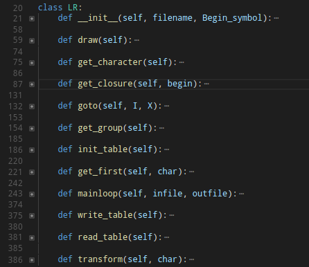
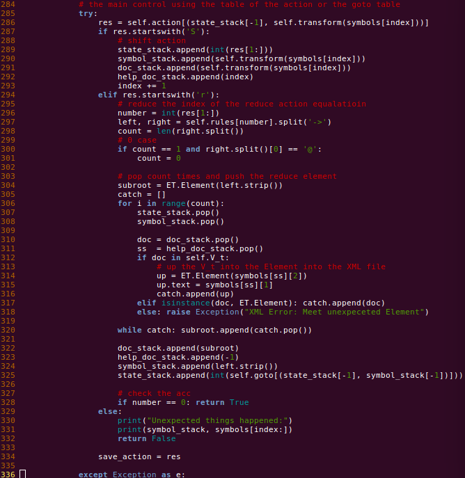
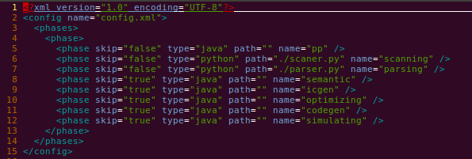
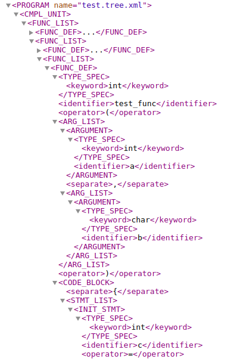
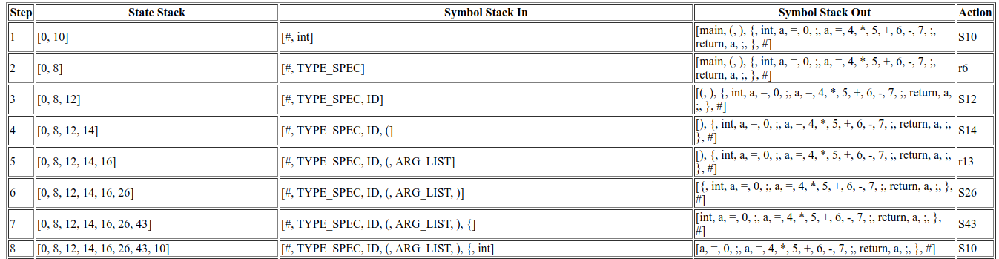

## 语法分析器实验报告

---

### 1. 实验目的

语法分析部分在编译过程中是非常重要的一个环节，通过语法分析，解析出代码文件的语法树具体架构，对于之后的语义分析和中间代码生成起到了非常重要的作用

在语法分析的过程中，我们需要读取在上一步 - **词法分析** 中获得的属性字流，并且根据定义的文法的上下文关系，将属性字不断的归约(或者推导出)对应的基本的语法单元和结构

语法分析的主要任务是:

1. 根据提供的语言的语法规则，对输入的属性字流构成的程序进行相应的文法检查
2. 使用对应的算法(**LL(1), LR(1), ...**)识别出对应的语法成分进行推导或者是归约

本次实验的目的在于: 

   	1. 实现 C 语言的文法子集
     2. 利用 LR(1) 分析的方法对文法子集进行移进-归约的识别
      3. 获得归约的语法树和解析过程(文件的形式输出，详见实验结果和分析部分)

### 2. 实验内容

1. 设计 C 语言的文法子集，并可以识别如下的语句结构(不仅限于)
   * 全局变量声明
   * 循环语句
   * 分支语句
   * 函数调用语句
   * 赋值语句
   * 返回值语句
   * 函数定义结构
2. 读取词法分析器的属性字流输出
3. 识别属性字流中的语法成分并进行归约
4. 识别出其中的语法成分或者是发现错误语法(结束并报告错误)

### 3. 实验平台和使用注意事项

1. 系统平台: Ubuntu 16.04 LTS

2. 实现语言: Python 3.6+ (因为格式输出的原因，请使用3.6的解释器)

3. 标准库:

   * pprint
   * os
   * sys
   * xml
   * lxml
   * pickle

4. 其他软件需求

   `dot 2.38.0`: 绘图使用

5. 注意事项

   1. 输入文件
      * `rules`: 文法文件
      * `test.token.xml`: 词法分析属性字流文件
      * `table.pkl`: 可能会输入，是文法分析的 action, goto 表的持久化存储
   2. 输出文件
      * `test.parser,xml`: 语法树结构 XML 文件
      * `test.parserprocessing.html`: 语法分析过程 HTML 文件
      * `table.pkl`: 可能会输出，是文法分析的 action, goto 表的持久化存储

### 4. 实验过程

1. 通过在 stackoverflow (https://stackoverflow.com) 中查询相关资料得知，标准的 C 语言是满足 LR(1) 文法的，所以从实现的角度上来看只要是不存在二义性的 C 语言文法子集都符合 LR(1) 文法，换句话来说都是可以被 LR(1) 分析器是识别的

2. LR(1) 泛指一类自左向右('L', Left-to-right) 对输入串进行扫描并且自下而上的('R', 最右推推导的逆序)的方法，绝大多数的程序设计语言均满足 LR(1) 分析方法(`C++` 中的 `lambda` 表达式是特例)，使用两个显示栈(符号栈和状态栈)来对输入的属性字流进行分析。

3. LR(1) 文法

   1. 总控程序

      1. 分析开始，将初始状态 S0 以及输入的左界符号 `#` 推入分析栈
      2. 对分析中的某一步，根据当前的分析栈的栈顶 Sm, 当前的输入符号 ai 查询 action 表
         * 如果 action[Sm, ai] = Sj, 完成移进动作，将当前的扫描的属性字推入符号栈并将状态 j 推入状态栈
         * 如果 action[Sm, ai] = rj, 完成归约动作，将部分符号栈和对应的状态栈中的元素出栈构成新的符号 ak 并推入符号栈中，根据 goto 表查询 将 goto[S', ak] 推入状态栈
         * 如果 action[Sm,ai]=acc, 分析成功，结束程序
         * 如果 action[Sm,ai]=error, 分析失败，转入出错处理
      3. 转 (2)

   2. 分析表构建

      LR(1) 分析的核心在于查询对应的 LR(1) 分析表 - action 表和 goto 表，所以建立分析表来说是最核心的 LR(1) 算法实现思路，主要的算法有以下几个

      1. 求解项目集的 `closure` 闭包
      2. 计算对饮的 `goto` 函数
      3. 利用 `closure` 和 `goto` 函数求解对应的 LR(1) 项目集规范族
      4. 根据对应的项目集规范族构建 LR(1) 分析表

   3. **特点: LR(1) 文法不存在二义性**

4. 实验基本思路

   1. 代码架构和主要功能组成

      1. 为了对文法和 LR(1) 分析器解耦和，我定义了通用的 `LR` 类专门对文法文件(约定好了编写标准)进行解析生成对应的项目集规范族和 LR(1) 分析表

      2. 为了方便调试，对生成项目集规范族集进行相应的处理，使用 `dot` 程序将对应的项目级规范族进行输出以供文法检查和分析的需要

      3. 将 LR(1) 分析的语法树通过 XML 文件树的形式呈现

      4. 将 LR(1) 分析的具体过程(步骤，栈内状态，栈内符号，栈外符号，分析动作)通过 HTML 表格的形式打印出来，对于文法分析的详细的细节有了更好的展现

      5. 核心代码的结构图示

         

         1. `draw`: 对生成的项目集规范族进行图片生成，使用 `dot` 命令生成对应的项目集规范族的图片形式，以供调试使用
         2. `get_character`: 扫描文法文件，并获取对应的终结符号和非终结符号信息
         3. `get_closure`: 获得制定的 LR(1) 项目的 `closure` 闭包
         4. `goto`: 获得项目集的转移信息
         5. `get_group`: 获得项目集规范族
         6. `init_table`: 根据项目集规范族初始化 action, goto 表
         7. `get_first`: 递归纠结 FIRST 集合
         8. `mainloop`: 主控算法和对于文件的解析和输出
         9. `write_table`: 序列化 action, goto 表
         10. `read_table`: 读取序列化的 action, goto 表
         11. `tranform`: 将属性字流转换成对应的文法符号

   2. 文法定义:

      C 语言具有非常复杂的 LR(1) 文法，项目集规范族会变得异常庞大，通过综合考虑我摒弃了手动书写 C 语言 LR(1) 文法项目集规范族的方法，采用程序自动生成，但是仍然需要 C 语言文法子集的定义作为输入，**这部分详见附录**

   3. 核心代码分析

      1. 主控算法

         

      2. 配置文件

         

### 5. 实验结果和分析

1. 测试代码

   ```C
   int globala = 1;
   char globalb = 'a';

   int test_func(int a, char b)
   {
       int c = 1;
       int d=2;
       test_func(c, d);
       while (d < 3) {
           if (c == 1) return 0;
           else {
               a = a + 1;
               printf("%d\n", a);
           }
       }
   }

   int main(){
   	int a = 0;
   	a = 4 * 5 + 6 - 7;

       for (a = 1; a = 10; a = a - 1) {
           int p = 1;
           p = p + 1;

           if (p) {
               p = p + 1;
           }
           else if (k < 1) p=p-1;
           else {
               a = a * p - p / (a + p);
           }
           int res = test_func(a, p);
       }
   	return a;
   }
   ```

2. 运行结果

   1. 语法树 XML 文件节选

      

   2. 语法分析流程 HTML 文件节选(语法分析表)

      

   3. 实验结果: 成功分析得到对应的语法树

### 6. 实验心得

1. LL(1), LR(1) 文法设计的感想

   在实验初期(文法设计阶段)，可以明显的感觉到文法的定义对整个语法分析器的能力的影响，首先，文法的决定了语法分析器的解析过程，如果定义的文法出现了问题对于语法分析器的工作的影响是灾难性的。但是这里又引出了一些其他的问题。

   1. 周围的同学大多数采用的是 LL(1) 文法进行解析，但是问题在于，如果我们定义的文法如果不是 LL(1) 文法(出现了多重定义的入口的话)，我们还需要将文法转换成 LL(1) 这个检错和纠错的过程十分的繁琐并且是大量的额重复无意义的劳动，归根究底在于，我们是为 C 语言定义文法子集， C 语言是属于 LR(1) 文法的限定要求的，这也就会说我们的定义的语法子集很可能不是 LL(1) 文法，带来的结果就是频繁的差错和纠错。

   2. 文法的二义性问题

      LL(1), LR(1) 很明显都不是二义性文法，但是如果我们设计的文法中引入了二义性的成分的话，这个错误的定位问题就会变得异常的苦难

   对于上述的两个问题进行综合考虑之后，我决定采用 LR(1) 文法来实现语法分析器，原因如下

   * C 语言是标准的 LR(1) 文法，我们的设计的文法子集基本上都会满足 LR(1) 文法的要求，但是 LL(1) 文法却不一定，从对文法的设计角度上来说，使用 LR(1) 可以节省大量的工作量
   * 文法的二义性， C 语言是非二义性文法，设计的文法如果是二义性文法的话，对应的 LR(1) 的action, goto 表的构建阶段可以有效的发现错误

   结果一段时间的观察，周围的大部分使用 LL(1) 文法的同学基本上在文法设计阶段投入了大量的经历，构建了异常庞大的文法约定，但是明显，如果采用 LR(1) 分析方法的话明显节省了大量的工作量

2. 出错处理和解耦和的好处

   1. 出错处理:

      在上课期间了解到了编译器的设计中如果某一个环节出现了错误，编译过程就应该立即停止这在这次的试验中感觉得到了一些理解

      在试验中，我在之前构建的词法分析器的基础上进行对应的语法分析器的构建工作，之前的词法分析器中的在属性子流中记录了一些错误的信息但是我们并没有立即的返还错误并终止程序而是通过对属性字打上错误标记实现的。但是在语法分析的设计和调试阶段中不断的会出现一些模型奇妙的错误，结果一段时间的调试和分析返现是词法分析阶段已经发现的错误并没有及时的得到反馈，因此在语法分析阶段不断的出现解析错误的情况，通过这样的调试经历对错误处理的必要性有了一定的认识

   2. 关于解耦和

      我在实验之前的准备工作中就有了这样的想法，我设计的语法分析器一定只能识别 C 语言吗?为什么不能根据定义的文法动态的解析识别不同的语言(只要是满足 LR(1) 文法的限制就可以了)?

      有了这样的需求，我对程序的架构上有了一定的考虑，我实现了一个对 LR(1) 文法进行解析和生成对于的项目集规范族的类，通过这个类来实现对应的文法的语法解析和识别工作。

      这一点对之后的调试过程也有很好的帮助，文法的设计不是一蹴而就的，**通过实现了文法和解析器的解耦和和分离** , 我设计和编写语法分析器的迭代速度相对来说比较快。

### 7. 附录

本次实验设计的 C 语言文法子集

```C
/* 
  1. this is the rule file of the C language, which is just the subcase of It, and I want to use these rules to create the parser for using, or this is the test file. 
  2. Do not allow the `|` in the rule
  3. The first rule must be the `PROGRAM -> ...` to satisfy the constraints of the LR(1).
  
  Author: GMFTBY - Lan Tian
  Time:   2018.4.28
*/

// 满足拓广文法的要求
PROGRAM -> CMPL_UNIT

// 程序体,全局变量声明和函数列表声明
CMPL_UNIT -> FUNC_LIST

// 函数列表,包括main函数
FUNC_LIST -> FUNC_DEF FUNC_LIST
FUNC_LIST -> @
  
// 函数定义声明
FUNC_DEF -> TYPE_SPEC ID ( ARG_LIST ) CODE_BLOCK
FUNC_DEF -> INIT_STMT ;

// 类型符号
TYPE_SPEC -> int
TYPE_SPEC -> void
TYPE_SPEC -> float
TYPE_SPEC -> double
TYPE_SPEC -> char

// 参数列表
ARG_LIST -> ARGUMENT
ARG_LIST -> ARGUMENT , ARG_LIST
ARG_LIST -> @

// 参数，类型和标识符
ARGUMENT -> TYPE_SPEC ID

// 代码段
CODE_BLOCK -> { STMT_LIST }

// 语句列表
STMT_LIST -> RTN_STMT ; STMT_LIST
STMT_LIST -> ASSIGN_STMT ; STMT_LIST
STMT_LIST -> INIT_STMT ; STMT_LIST
STMT_LIST -> ITER_STMT STMT_LIST
STMT_LIST -> IF_STMT STMT_LIST
STMT_LIST -> EXPR ; STMT_LIST
STMT_LIST -> @

// 语句: 返回值语句，赋值语句，初始化语句，比较语句，分支语句，循环语句，表达式
//       函数调用语句(从属于表达式语句)
STMT -> RTN_STMT
STMT -> ASSIGN_STMT
STMT -> INIT_STMT
STMT -> ITER_STMT
STMT -> IF_STMT
STMT -> JUST_STMT
STMT -> EXPR
  
// 循环语句，实现 for, while 
ITER_STMT -> for ( STMT ; STMT ; STMT ) CODE_BLOCK
ITER_STMT -> for ( STMT ; STMT ; STMT ) STMT
ITER_STMT -> while ( STMT ) CODE_BLOCK
ITER_STMT -> while ( STMT ) STMT

// 比较语句
JUST_STMT -> EXPR < EXPR
JUST_STMT -> EXPR > EXPR
JUST_STMT -> EXPR >= EXPR
JUST_STMT -> EXPR <= EXPR
JUST_STMT -> EXPR == EXPR
JUST_STMT -> EXPR != EXPR

// 分支语句, if, if-else
IF_STMT -> if ( STMT ) CODE_BLOCK
IF_STMT -> if ( STMT ) STMT ;
IF_STMT -> if ( STMT ) CODE_BLOCK else CODE_BLOCK
IF_STMT -> if ( STMT ) CODE_BLOCK else IF_STMT
IF_STMT -> if ( STMT ) STMT ; else CODE_BLOCK
IF_STMT -> if ( STMT ) STMT ; else IF_STMT
  
// 函数调用语句
CALL_STMT -> ID ( PARG_LIST )
PARG_LIST -> PARG
PARG_LIST -> PARG , PARG_LIST
PARG_LIST -> @
PARG -> ID
PARG -> CONST
PARG -> ( EXPR )
PARG -> CALL_STMT

// 返回值语句
RTN_STMT -> return EXPR

// 赋值语句
ASSIGN_STMT -> ID = EXPR
  
// 初始化语句
INIT_STMT -> TYPE_SPEC ID
INIT_STMT -> TYPE_SPEC ID = EXPR

// 表达式
EXPR -> TERM EXPR2
EXPR2 -> + TERM EXPR2
EXPR2 -> - TERM EXPR2
EXPR2 -> @
TERM -> FACTOR TERM2 
TERM2 -> * FACTOR TERM2
TERM2 -> / FACTOR TERM2
TERM2 -> @

// 标识符，　常量，　子表达式, 标识符可以包含有关键字
// 五大组成部分: 标识符，常量，关键字，分隔符，运算符
FACTOR -> ID
FACTOR -> CONST
FACTOR -> ( EXPR )
FACTOR -> CALL_STMT
```

