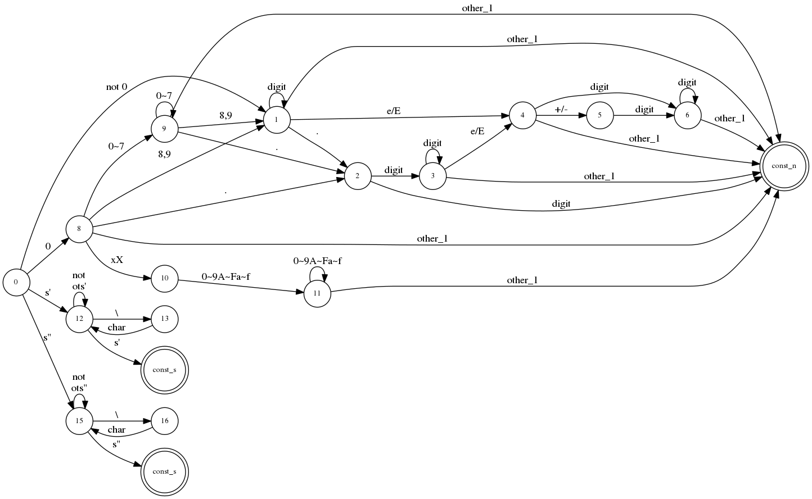
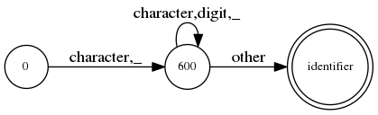
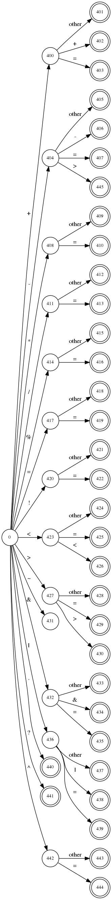
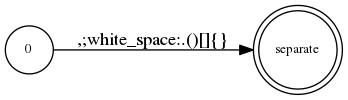
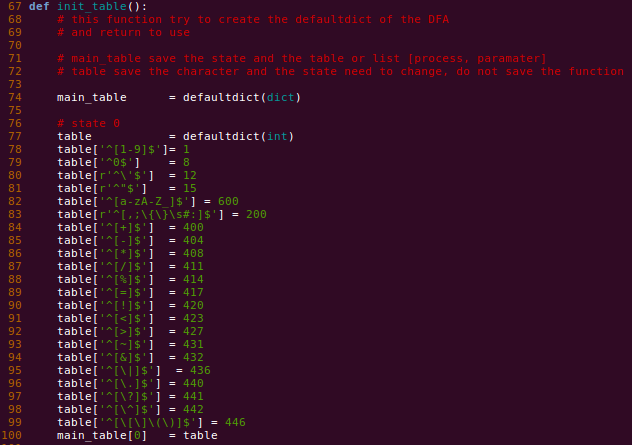
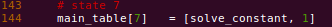
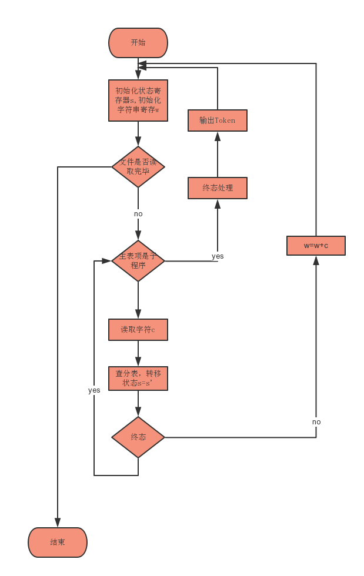

## 词法分析器实验报告

---

### 1. 实验目的和内容

1. 阅读 BITMinicCompiler 框架的代码结构，为本次试验和之后的实验打下良好的基础
2. 根据提供的 C 语言的标准设计相应的 5 大类分类对应的 DFA (包括出错处理的 DFA)
3. 使用数据中心法实现设计的 DFA ，并完成总控程序的算法的编写，完整实现整个词法分析器
4. 编写相应的测试文件
   * 正确案例测试文件 - 测试设计的 DFA 的有效性
   * 错误案例测试文件 - 测试设计的 DFA 的容错性能和错误识别能力
5. 在测试文件上多次运行词法分析器并完善代码的结构和功能
6. 编写 XML 文件写入模块，将所有的词法分析结果按照 XML 文件的约定写入文件中

### 2. 实验环境和配置信息

1. 宿主机环境

   * Ubuntu 16.04
   * Openjdk-1.8 / jre 1.8
   * Python 3.6

2. 运行环境配置

   ```shell
   #!/bin/bash
   java -jar BITMiniCC.jar test.c	# test.c 为测试文件
   ```

### 3. 实验的具体过程和步骤

1. 框架代码阅读

   实验使用 Python 语言进行编写，因此对 Python 提供的接口进行了相关的研读

   * 框架的主入口文件 - BITMiniCC.java

     创建 MiniCCompiler 对象执行运行函数 (run)

   * 运行函数文件 - MinCCompiler.java

     1. readConfig

        读取 config.xml 文件并解析生成对应的接口文件(输入文件，输出文件标准格式和文件名)

     2. runPy

        根据 config.xml 文件中的配置，执行对应的 Python 脚本生成输出的 XML 文件(属性字流)

2. DFA 设计

   1. 常数类型

      * 常数类型包含 - 整型常数，实型常数，8进制常数，16进制常数，字符，字符串等等类型

      * C11标准定义文法(子集实现)

        ```c
        # 整形常量
        In		->		Dec | Oct | Hex
        Dec		->		nd | Dec+d
        Oct		->		0 | Oct+od
        Hex		->		Hex-pre+hd | Hex+hd
        hd		->		0x | 0X
        nd		->		1|2|3|4|5|6|7|8|9
        od		->		0|1|2|3|4|5|6|7
        hd		->		0|1|2|3|4|5|6|7|8|9|a|b|c|d|e|f|A|B|C|D|E|F
          
        # 字符常量
        c-char-sequence	->	c-char | c-char-sequence+c-char
        c-char			->	除了 ', \, \n 之外的任何字符 | 转义字符

        # 字符串常量
        string-literal:	-> 	s-char-sequence
        s-char-sequence -> 	s-char | s-char-sequence+s-char
        s-char			->	除了 ", \, \n 之外的任何字符 | 转义字符
        ```

      * 设计图

        ​    

   2. 标识符 / 关键字类型

      * 标识符包含各类名字的表示，比如变量名，数组名，函数名，文件名

        因为标识符和关键字的内聚性比较强，所以在词法分析器的具体实现中，我采用了将标识符和关键字混合分类判断的方式:

        __对每一个识别出来的标识符进行二次加工处理，判断是否是关键字，从而对这两种类型在词法分析的阶段中进行区分__

      * C11标准定义文法(子集实现)

        ```c
        ID		->	ID-nd | ID+ID-nd | ID+d
        ID-nd	->	nd
        nd		->	_|a|b|c|d|e|f|g|h|i|j|k|l|m|n|o|p|q|r|s|t|u|v|w| 	 x|y|z|A|B|C|D|E|F|G|H|I|J|K|L|M|N|O|P|Q|R|S|T|U|V|W|X|Y|Z
        d		->	0|1|2|3|4|5|6|7|8|9
        ```

      * 设计图

        

   3. 运算符

      * 表示程序中的算数运算，逻辑运算，字符，串操作等运算的确定字符(串)

      * C11

        ```c
        [], (), ->, .
        !, -, ++, --, &, *, +, -, ~
        /, %, <<, >>, <, >, <=, >=, ==, !=, ^, |, &&, ||
        ?, :, ;, ...
        =, *=, /=, %=, +=, -=, <<=, >>=, &=, ^=, |=
        ,, #, ##
        ```

      * 设计图

        

   4. 分隔符

      * 逗号，分号，括号，单引号，双引号等等

      * C11

        ```c
        ,, ;, {, }
        ```

      * 设计图

        

   5. 总结

      1. 特点

         * 32个关键字全部支持 

         * 运算符支持

           ```c
           +, +=, ++, -, --, -=, ->, *, *=, /, /=, %, %=, =, ==, !, !=, ~, ?
           &, &&, &=, |, ||, |=, <, <<, <=, >, >=, >>, ., ^, ^=, ., [, ], (, )
           ```

         * 常量支持

           1. 十进制整数，八进制整数，十六进制整数，十进制浮点数，八进制浮点数，十六进制浮点数，科学计算法支持

              ```c
              int a = 0123.1 + 0x26E10 - 32.13e-301 * 32
              ```

           2. 字符类型支持，字符串类型支持(支持内部的转义操作)

              ```c
              printf("teacher said 'You are the good student!\n'! \n");
              ```

         * 分隔符支持

           ```c
           ,, ;, :, {, }
           所有的空白字符(但是不统计)
           ```

      2. 支持行数统计

      3. 支持错误处理和标注(非法字符和非法状态)

      4. 上述的功能可以适应词法分析器的绝大部分功能，对之后的语法分析和绝大部分的功能可以有效的支持，在此基础上的语法分析和中间代码生成都可以支持绝大部分的 C 语言的功能

3. 实现词法分析器

   1. 数据中心法

      * 主表: 记录状态和对应的状态对应的处理函数或者分表入口

        1. 如果是终态，对应的主表项是函数对象(Python)
        2. 如果是中间状态，对应的主表项是分表

      * 分表: 记录从当前的状态经过字符转换到的状态的映射关系

      * 实现方式

        1. 使用 Python 中的 defultdict 对象

           ```python
           from collections import defaultdict
           # 主表
           main_table = defaultdict(dict)

           # 分表
           table	   = defaultdict(list)
           ```

        2. 对于分表中的字符状态检测采用 re 包的正则表达式实现，有助于程序的可扩展性和修改的便捷性

        3. 非法状态的检测

           根据当前的状态选择分表入口之后，如果对分表项中的所有正则表达式都不能有效的识别的话，程序认为即将进入非法状态，并在之后的状态返回中对 valid 属性进行相应的填充

      * 实现细节

        1. 为 5 个分类创建了 5 个函数对象以及一个错误状态处理函数对象，作为对终态的处理方式加入到 defaultdict 中

           ```python
           def solve_separate(string, state):
               return [string, "separate", True]

           def solve_constant(string, state):
               # 内部还会检测识别的数字是否是合法的，比如 018 的错误
               if wrong:
                   return [string, "constant", False]
               return [string, 'constant', True]

           def solve_identifier(string, state):
               # 内部使用 keyword 列表对识别的 identifier 
               # 进行关键字的识别，如果满足关键字的条件则为关键字类别
               # 否则是朴素的 identifier 标识符名称
               if string in keyword:
                   return [string, "keyword", True]
               else
                   return [string, "identifier", True]

           def solve_operator(string, state):
               return [string, "operator", True]

           def solve_wrong(string, state):
               return [string, "WRONG", False]
           ```

        2. 分表中的键是对读入字符的描述的**正则表达式**

           示例如图，下图是对 0 号状态的分表的构建

           

        3. 主表中的终态，使用对应的终态状态作为键，使用带有参数的函数列表作为值

           

   2. 总控算法

      1. 流程图

         

      2. 实现细节

         * 使用 Python 语言实现
         * 因为在从表中设置了对字符匹配的正则表达式，所以实际处理中，只需要创建正则表达式对象然后识别正则表达式的内容实现状态的转移即可
         * 因为在识别的过程中，在 DFA 的设计中因为额外的使用之后的字符判断之前的状态的信息，在识别终态之后需要对有些字符进行回退 `untread` 操作
         * 使用列表 `list` 收集所有的终态函数处理结果并在之后的  `XML` 文件中输出

      3. 关键代码阐释

         | 名称             | 输入         | 输出    | 作用                    |
         | -------------- | ---------- | ----- | --------------------- |
         | write_file     | 写入路径，属性流列表 | 无     | 将属性流写入到 XML 文件中       |
         | run            | 读入路径，主从表   | 属性流列表 | 解析读入C语言文件并利用总控算法抽取属性流 |
         | init_table     | 无          | 主从表   | 初始化构建主从表(DFA)         |
         | solve_operator | 字符串寄存器     | 属性字   | 运算符终态处理函数             |
         | solve_name     | 字符串寄存器     | 属性字   | 标识符和关键字终态处理函数         |
         | solve_constant | 字符串寄存器     | 属性字   | 常量终态处理函数              |
         | solve_separate | 字符串寄存器     | 属性字   | 分隔符终态处理函数             |
         | solve_wrong    | 字符串寄存器     | 属性字   | 异常终态处理函数              |

4. 测试文件文件编写

   * 按照 DFA 的设计精心编写了对应的正确测试文件和错误测试文件
   * 从 C 语言代码混淆大赛中的往届参赛代码中挑选测试文件，修正 DFA 结构

### 4. 运行效果

1. 源文件

   ```c
   #define NUM 4

   /* this is a demo program */

   char* function(int i)
   {
       return 'a';
   }

   int main(){
   	int a = 0;
   	a = NUM * 5 + 6 - 7; //here is a macro

       for(int i = 1; i <= 10; i++) {
           printf("Something will be compiled here!\n");
           function(i);
       }
   	return a;
   }
   ```

2. 预处理文件

   ```c
    
   char * function ( int i ) 
    { 
    return 'a' ; 
    } 
   int main ( ) { 
    int a = 0 ; 
    a = 4 * 5 + 6 - 7 ; 
    for ( int i = 1 ; i <= 10 ; i ++ ) { 
    printf ( "Something will be compiled here!\n" ) ; 
    function ( i ) ; 
    } 
    return a ; 
    } 
   ```

3. 配置 config.xml 文件

   ```xml
   <?xml version="1.0" encoding="UTF-8"?>
   <config name="config.xml">
     <phases>
       <phase>
         <phase skip="false" type="java" path="" name="pp" />
         <phase skip="false" type="python" path="./script/scaner.py" name="scanning" />
         <phase skip="false" type="java" path="" name="parsing" />
         <phase skip="true" type="java" path="" name="semantic" />
         <phase skip="true" type="java" path="" name="icgen" />
         <phase skip="true" type="java" path="" name="optimizing" />
         <phase skip="true" type="java" path="" name="codegen" />
         <phase skip="true" type="java" path="" name="simulating" />
       </phase>
     </phases>
   </config>
   ```

4. 生成属性字流

   执行框架运行脚本

   ```shell
   java -jar BITMiniCC.jar test.c
   ```

   程序的运行结果如下

   ```xml
   <?xml version="1.0" encoding="UTF-8"?>
   <project name="test.c">
     <tokens>
       <token>
         <number>1</number>
         <value>char</value>
         <type>keyword</type>
         <line>2</line>
         <valid>True</valid>
       </token>
       <token>
         <number>2</number>
         <value>*</value>
         <type>operator</type>
         <line>2</line>
         <valid>True</valid>
       </token>
       <token>
         <number>3</number>
         <value>function</value>
         <type>identifier</type>
         <line>2</line>
         <valid>True</valid>
       </token>
       <token>
         <number>4</number>
         <value>(</value>
         <type>operator</type>
         <line>2</line>
         <valid>True</valid>
       </token>
       <token>
         <number>5</number>
         <value>int</value>
         <type>keyword</type>
         <line>2</line>
         <valid>True</valid>
       </token>
       <token>
         <number>6</number>
         <value>i</value>
         <type>identifier</type>
         <line>2</line>
         <valid>True</valid>
       </token>
       <token>
         <number>7</number>
         <value>)</value>
         <type>operator</type>
         <line>2</line>
         <valid>True</valid>
       </token>
       <token>
         <number>8</number>
         <value>{</value>
         <type>separate</type>
         <line>3</line>
         <valid>True</valid>
       </token>
       <token>
         <number>9</number>
         <value>return</value>
         <type>keyword</type>
         <line>4</line>
         <valid>True</valid>
       </token>
       <token>
         <number>10</number>
         <value>'a'</value>
         <type>constant</type>
         <line>4</line>
         <valid>True</valid>
       </token>
       <token>
         <number>11</number>
         <value>;</value>
         <type>separate</type>
         <line>4</line>
         <valid>True</valid>
       </token>
       <token>
         <number>12</number>
         <value>}</value>
         <type>separate</type>
         <line>5</line>
         <valid>True</valid>
       </token>
       <token>
         <number>13</number>
         <value>int</value>
         <type>keyword</type>
         <line>6</line>
         <valid>True</valid>
       </token>
       <token>
         <number>14</number>
         <value>main</value>
         <type>identifier</type>
         <line>6</line>
         <valid>True</valid>
       </token>
       <token>
         <number>15</number>
         <value>(</value>
         <type>operator</type>
         <line>6</line>
         <valid>True</valid>
       </token>
       <token>
         <number>16</number>
         <value>)</value>
         <type>operator</type>
         <line>6</line>
         <valid>True</valid>
       </token>
       <token>
         <number>17</number>
         <value>{</value>
         <type>separate</type>
         <line>6</line>
         <valid>True</valid>
       </token>
       <token>
         <number>18</number>
         <value>int</value>
         <type>keyword</type>
         <line>7</line>
         <valid>True</valid>
       </token>
       <token>
         <number>19</number>
         <value>a</value>
         <type>identifier</type>
         <line>7</line>
         <valid>True</valid>
       </token>
       <token>
         <number>20</number>
         <value>=</value>
         <type>operator</type>
         <line>7</line>
         <valid>True</valid>
       </token>
       <token>
         <number>21</number>
         <value>0</value>
         <type>constant</type>
         <line>7</line>
         <valid>True</valid>
       </token>
       <token>
         <number>22</number>
         <value>;</value>
         <type>separate</type>
         <line>7</line>
         <valid>True</valid>
       </token>
       <token>
         <number>23</number>
         <value>a</value>
         <type>identifier</type>
         <line>8</line>
         <valid>True</valid>
       </token>
       <token>
         <number>24</number>
         <value>=</value>
         <type>operator</type>
         <line>8</line>
         <valid>True</valid>
       </token>
       <token>
         <number>25</number>
         <value>4</value>
         <type>constant</type>
         <line>8</line>
         <valid>True</valid>
       </token>
       <token>
         <number>26</number>
         <value>*</value>
         <type>operator</type>
         <line>8</line>
         <valid>True</valid>
       </token>
       <token>
         <number>27</number>
         <value>5</value>
         <type>constant</type>
         <line>8</line>
         <valid>True</valid>
       </token>
       <token>
         <number>28</number>
         <value>+</value>
         <type>operator</type>
         <line>8</line>
         <valid>True</valid>
       </token>
       <token>
         <number>29</number>
         <value>6</value>
         <type>constant</type>
         <line>8</line>
         <valid>True</valid>
       </token>
       <token>
         <number>30</number>
         <value>-</value>
         <type>operator</type>
         <line>8</line>
         <valid>True</valid>
       </token>
       <token>
         <number>31</number>
         <value>7</value>
         <type>constant</type>
         <line>8</line>
         <valid>True</valid>
       </token>
       <token>
         <number>32</number>
         <value>;</value>
         <type>separate</type>
         <line>8</line>
         <valid>True</valid>
       </token>
       <token>
         <number>33</number>
         <value>for</value>
         <type>keyword</type>
         <line>9</line>
         <valid>True</valid>
       </token>
       <token>
         <number>34</number>
         <value>(</value>
         <type>operator</type>
         <line>9</line>
         <valid>True</valid>
       </token>
       <token>
         <number>35</number>
         <value>int</value>
         <type>keyword</type>
         <line>9</line>
         <valid>True</valid>
       </token>
       <token>
         <number>36</number>
         <value>i</value>
         <type>identifier</type>
         <line>9</line>
         <valid>True</valid>
       </token>
       <token>
         <number>37</number>
         <value>=</value>
         <type>operator</type>
         <line>9</line>
         <valid>True</valid>
       </token>
       <token>
         <number>38</number>
         <value>1</value>
         <type>constant</type>
         <line>9</line>
         <valid>True</valid>
       </token>
       <token>
         <number>39</number>
         <value>;</value>
         <type>separate</type>
         <line>9</line>
         <valid>True</valid>
       </token>
       <token>
         <number>40</number>
         <value>i</value>
         <type>identifier</type>
         <line>9</line>
         <valid>True</valid>
       </token>
       <token>
         <number>41</number>
         <value>&lt;=</value>
         <type>operator</type>
         <line>9</line>
         <valid>True</valid>
       </token>
       <token>
         <number>42</number>
         <value>10</value>
         <type>constant</type>
         <line>9</line>
         <valid>True</valid>
       </token>
       <token>
         <number>43</number>
         <value>;</value>
         <type>separate</type>
         <line>9</line>
         <valid>True</valid>
       </token>
       <token>
         <number>44</number>
         <value>i</value>
         <type>identifier</type>
         <line>9</line>
         <valid>True</valid>
       </token>
       <token>
         <number>45</number>
         <value>++</value>
         <type>operator</type>
         <line>9</line>
         <valid>True</valid>
       </token>
       <token>
         <number>46</number>
         <value>)</value>
         <type>operator</type>
         <line>9</line>
         <valid>True</valid>
       </token>
       <token>
         <number>47</number>
         <value>{</value>
         <type>separate</type>
         <line>9</line>
         <valid>True</valid>
       </token>
       <token>
         <number>48</number>
         <value>printf</value>
         <type>identifier</type>
         <line>10</line>
         <valid>True</valid>
       </token>
       <token>
         <number>49</number>
         <value>(</value>
         <type>operator</type>
         <line>10</line>
         <valid>True</valid>
       </token>
       <token>
         <number>50</number>
         <value>"Something will be compiled here!\n"</value>
         <type>constant</type>
         <line>10</line>
         <valid>True</valid>
       </token>
       <token>
         <number>51</number>
         <value>)</value>
         <type>operator</type>
         <line>10</line>
         <valid>True</valid>
       </token>
       <token>
         <number>52</number>
         <value>;</value>
         <type>separate</type>
         <line>10</line>
         <valid>True</valid>
       </token>
       <token>
         <number>53</number>
         <value>function</value>
         <type>identifier</type>
         <line>11</line>
         <valid>True</valid>
       </token>
       <token>
         <number>54</number>
         <value>(</value>
         <type>operator</type>
         <line>11</line>
         <valid>True</valid>
       </token>
       <token>
         <number>55</number>
         <value>i</value>
         <type>identifier</type>
         <line>11</line>
         <valid>True</valid>
       </token>
       <token>
         <number>56</number>
         <value>)</value>
         <type>operator</type>
         <line>11</line>
         <valid>True</valid>
       </token>
       <token>
         <number>57</number>
         <value>;</value>
         <type>separate</type>
         <line>11</line>
         <valid>True</valid>
       </token>
       <token>
         <number>58</number>
         <value>}</value>
         <type>separate</type>
         <line>12</line>
         <valid>True</valid>
       </token>
       <token>
         <number>59</number>
         <value>return</value>
         <type>keyword</type>
         <line>13</line>
         <valid>True</valid>
       </token>
       <token>
         <number>60</number>
         <value>a</value>
         <type>identifier</type>
         <line>13</line>
         <valid>True</valid>
       </token>
       <token>
         <number>61</number>
         <value>;</value>
         <type>separate</type>
         <line>13</line>
         <valid>True</valid>
       </token>
       <token>
         <number>62</number>
         <value>}</value>
         <type>separate</type>
         <line>14</line>
         <valid>True</valid>
       </token>
     </tokens>
   </project>
   ```

   ​

### 5. 实验心得体会

1. 对 DFA 设计的心得

   * 在对 DFA 的设计的初期，因为只是设计了 DFA 的大致的轮廓，然后开始对主从表的代码编写，在这里，因为在编写代码期间不断的发现 DFA 的设计上存在偏差，所以造成了我在之后的不断的对 DFA 进行修改，对开发效率的影响非常的大
   * 但是在设计 DFA 的时候，那面会出现不同的设计上的错误需要在后期进行修正，所以我认为在开发的时候最重要的不是一开始设计一个非常完善的 DFA, 而是设计一个可以在后期便利修改的一个 DFA 框架
   * 所以在重新设计 DFA 的时候，我采用了作用域的思想，将 5 大类的 DFA 分成了 5 个作用域来分别设计，之间并不互相影响，虽然可能会出现部分极端的用例分类的 DFA 不能有效的识别但是极大的便捷了我的程序开发

2. 对数据中心方法和程序中心方法的一些分析

   * 在异常情况处理的过程中

     1. 使用程序为中心的方法设计 DFA 的话，如果在后期需要加入异常的是被情况的话，需要在大量的状态程序中都加入相对应的异常处理的分支语句
     2. 但是在数据为中心的实现中，只要在分表中没有查询到的状态跳转均可以认为是非法的，从而在设计主从表的时候隐含的对所有的异常情况都进行了有效的处理(当然处理程序还是在总控算法中的)

   * 在 DFA 框架改动的方面的考虑

     1. 如果使用程序为中心的方法的话，如果对 DFA 进行部分改动的话(这里的改动指的是状态的添加和删除等等)需要对整个处理函数进行相应的修改和添加，不仅工作量巨大，并且在后期如果如果要对状态的编号进行修正的话，所有的相关的 DFA 状态的处理函数都需要修正，工作量极大
     2. 如果使用数据为中心的方法的话，DFA 的设计和总控算法之间是脱离的，这使得对 DFA 的所有改动都只局限于对主从表的修改，相对来说修正的工作量很小，并且因为 DFA 框架和算法的分离，实现了代码模块的解耦保证了程序的模块化，降低了程序的编码复杂度

     所以综合上述考虑，我决定使用数据为中心的方法来设计对应的 DFA 而不是使用程序为中心的方法

3. 此次的试验中再次体会到了 Python 语言在快速构建项目原型方面的强大的便捷性和通用性，并掌握了大量的 Python 语言的使用方法，每一次的修改感觉都是对状态机和功能的完善，为了加强此番分析器的通用性，我还在 C 语言代码混淆大赛上查询很多的混乱风格的代码用于测试，强化了词法分析器的性能

   附上 C 代码混淆大赛的链接 http://www.ioccc.org/

   ​